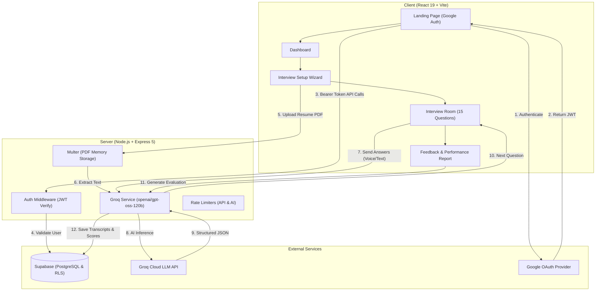

# PrepMate — AI-Powered Mock Interview Platform

> **Practice interviews tailored to your exact resume, target role, and company — with real-time AI questions, voice dictation, and hiring-bar feedback.**

PrepMate is an end-to-end AI mock interview platform built with **React 19**, **Node.js/Express**, **Supabase (PostgreSQL & Google OAuth)**, and **Groq Cloud LLMs (`openai/gpt-oss-120b`)**. It extracts your experience and tech stack from your uploaded PDF resume, generates adaptive questions in either **Technical** or **HR Behavioral** modes, simulates a real interview session with voice synthesis and speech recognition, and produces an evaluation report with scoring and 10/10 model answers.

---

## 📋 Table of Contents

1. [Architecture & System Flow](#-architecture--system-flow)
2. [Key Features](#-key-features)
3. [Technology Stack](#-technology-stack)
4. [Project Directory & File Guide](#-project-directory--file-guide)
   - [Backend (`server/`)](#1-backend-server)
   - [Frontend (`client/`)](#2-frontend-client)
   - [Database Schema & Tables](#3-database-schema--tables)
5. [API Reference (Backend Routes)](#-api-reference-backend-routes)
6. [Frontend Route Map](#-frontend-route-map)
7. [Environment Variables](#-environment-variables)
8. [Installation & Setup](#-installation--setup)
9. [Security, Rate Limiting & Error Handling](#-security-rate-limiting--error-handling)

---

## 🏗️ Architecture & System Flow



### Complete User Workflow:
1. **Authentication**: Users sign in via Google OAuth directly from the landing page. Supabase issues a JWT access token.
2. **Dashboard**: Shows greeting, session statistics, quick-launch track cards, and recent interview history with status pills and scores.
3. **Setup Wizard**:
   - The user drops a PDF resume (up to 5MB).
   - Server parses the PDF text in memory and Groq extracts structured candidate data (skills, projects, experience).
   - User chooses target role, company, and interview track (Technical or HR Behavioral).
4. **Live Interview Arena (15 Questions)**:
   - Left panel shows the active AI question, topic tag, follow-up badge, and voice controls.
   - Right panel displays conversation history and an answer textarea with microphone dictation (`Web Speech API`).
   - AI speaks prompts aloud via speech synthesis; questions adapt dynamically based on previous answers.
   - Upon submitting Question 15, the AI automatically wraps up with a concluding thank-you turn.
5. **Comprehensive Feedback Report**:
   - Visual score ring (0–100) with benchmark tiers (*Excellent*, *Proficient*, *Developing*, *Needs Work*).
   - 4-metric competency breakdown (Technical/Behavioral Depth, Problem Solving, Communication, Role Alignment).
   - Strengths, improvement opportunities, and concrete action plan.
   - Interactive Q→A breakdown featuring full candidate answers, hiring manager critiques, and 10/10 ideal responses.
   - One-click Print / Save as PDF support (`window.print()`).

---

## ✨ Key Features

- **⚡ Resume-Aware Questions**: Tailors every question to the candidate's actual projects, languages, frameworks, and career history extracted directly from their PDF.
- **🎯 Dual Modes**:
  - **Technical Interview**: Algorithms, data structures, system architecture, database design, and code optimization.
  - **HR & Behavioral**: STAR methodology, conflict resolution, teamwork, culture fit, and leadership stories.
- **🎙️ Speech-to-Text & Text-to-Speech**:
  - Voice dictation with real-time interim results.
  - Natural speech synthesis with mute/unmute and replay controls.
- **📊 15-Question Structured Loops**: Tracks progress dot-by-dot with graceful session completion.
- **🛡️ Multi-Tier Rate Limiting**: Protects general endpoints (100 req / 15 min) and expensive AI operations (30 req / min) from abuse.
- **🔒 Enterprise-Grade Security**: Row Level Security (RLS) policies on Supabase ensure candidates can strictly access only their own interview transcripts and feedback reports.

---

## 🛠️ Technology Stack

| Layer | Technology | Description |
|---|---|---|
| **Frontend Framework** | **React 19** | Latest React with functional components and hooks |
| **Build Tool & Bundler** | **Vite 6** | Ultra-fast HMR and optimized production bundling |
| **Routing** | **React Router v7** | Client-side routing with guarded routes and layout wrappers |
| **Styling** | **Vanilla CSS + TailwindCSS v4** | Modern light theme with curated HSL tokens, glassmorphism, and micro-animations |
| **Icons & Media** | Native SVG + WebP | Lightweight, vector-crisp branding and custom SVGs |
| **Backend Runtime** | **Node.js (v18+)** | Modern JavaScript using ES Modules (`import`/`export`) |
| **Web Framework** | **Express 5** | High-performance HTTP server |
| **AI Inference** | **Groq SDK** (`openai/gpt-oss-120b`) | Ultra-low-latency model execution with structured JSON response guarantees |
| **Database & Auth** | **Supabase** | Managed PostgreSQL with Row Level Security and Google OAuth |
| **PDF Processing** | **`pdf-parse`** | High-efficiency server-side PDF text extraction in memory |
| **File Handling** | **`multer`** | In-memory multipart file upload with 5MB cap and mime-type filters |
| **Rate Limiting** | **`express-rate-limit`** | IP-based request throttling across general and AI routes |

---

## 📁 Project Directory & File Guide

### 1. Backend (`server/`)

```
server/
├── config/
│   └── index.js                   # Environment variable loader and fallback definitions
├── controllers/
│   ├── interviewController.js     # Interview lifecycle: create, list, message loop, complete, feedback
│   └── resumeController.js        # Handles POST /api/resume/extract and PDF processing
├── middleware/
│   ├── auth.js                    # Validates Supabase JWT access tokens via Bearer header
│   └── rateLimiter.js             # Express rate limiters: apiLimiter (general) and aiLimiter (AI routes)
├── prompts/
│   ├── feedbackPrompt.js          # Feedback evaluation prompt & rubric generator
│   ├── hrPrompt.js                # Behavioral HR interviewer persona and start message
│   ├── resumePrompt.js            # Resume structured JSON extraction prompt
│   └── technicalPrompt.js         # Technical interviewer persona and start message
├── routes/
│   ├── health.js                  # GET /api/health server health check
│   ├── interview.js               # Interview CRUD and dialogue endpoints
│   └── resume.js                  # Multer upload middleware & resume extraction route
├── services/
│   ├── groqService.js             # Groq SDK wrapper for chat completions & one-shot prompts
│   ├── resumeService.js           # PDF parsing with pdf-parse and resource cleanup
│   └── supabaseService.js         # Admin Supabase client using Service Role Key
├── utils/
│   └── validateAIResponse.js      # Strips markdown fences, parses JSON, and validates schema
├── package.json                   # Server dependencies & scripts
└── server.js                      # Express application entrypoint, CORS, routes & error handling
```

#### File-by-File Details:
- **`server.js`**: Boots the Express server on port 5000 (or `PORT`). Configures CORS for `http://localhost:5173`, JSON body parsing, applies global rate limiting, mounts API routers, and sets up 404/500 error handlers.
- **`config/index.js`**: Central configuration module reading `PORT`, `CLIENT_URL`, `SUPABASE_URL`, `SUPABASE_SERVICE_ROLE_KEY`, `GROQ_API_KEY`, and `GROQ_MODEL`.
- **`middleware/auth.js`**: `requireAuth` middleware. Extracts the Bearer token from `req.headers.authorization`, calls `supabase.auth.getUser(token)`, and attaches the verified user to `req.user`. Returns `401 Unauthorized` if invalid.
- **`middleware/rateLimiter.js`**:
  - `apiLimiter`: 100 requests per 15 minutes for standard API endpoints.
  - `aiLimiter`: 30 requests per minute per IP for AI-intensive operations.
- **`controllers/resumeController.js`**: Extracts candidate information from `req.file.buffer` using `extractResumeProfile` and returns structured JSON.
- **`controllers/interviewController.js`**:
  - `createInterview`: Creates row in Supabase, calls Groq for Question 1, saves to transcript, returns `interviewId`.
  - `listInterviews`: Returns all past sessions for the authenticated user ordered by date.
  - `getInterview`: Fetches single interview ensuring `user_id === req.user.id`.
  - `handleMessage`: Receives user answer; checks 15-question limit (terminating with closing turn if reached) or calls Groq for the next question.
  - `completeInterview`: Marks interview as completed, generates AI feedback, and stores scores.
  - `getFeedback`: Retrieves cached feedback or generates it on the fly.
  - `transcriptToChatHistory`: Converts internal transcript records to standard chat completion turns (`assistant` / `user`).
- **`routes/health.js`**: Simple `GET /api/health` status check.
- **`routes/resume.js`**: Configures `multer` memory storage (5MB max, PDF only) and wraps errors cleanly via `uploadMiddleware`. Mounts `POST /extract`.
- **`routes/interview.js`**: Mounts interview endpoints guarded by `requireAuth`.
- **`services/groqService.js`**: Communicates with Groq Cloud API using `openai/gpt-oss-120b`. Exposes `generateContent` (for one-shot prompts) and `generateChatResponse` (for multi-turn dialogue).
- **`services/resumeService.js`**: Reads raw text from PDF buffers via `pdf-parse`, frees memory in `finally` with `parser.destroy()`, sends text to AI, and validates structure.
- **`services/supabaseService.js`**: Creates the admin Supabase client with the service role key to perform database mutations.
- **`prompts/resumePrompt.js`**: Prompt schema enforcing extraction of name, contact, summary, education, skills, projects, and certifications.
- **`prompts/technicalPrompt.js`**: Technical interviewer persona rules, formatting candidate profile, and adaptive questioning guidelines.
- **`prompts/hrPrompt.js`**: Behavioral HR persona exploring leadership, STAR examples, and teamwork stories.
- **`prompts/feedbackPrompt.js`**: Post-interview evaluation prompt generating scores, qualitative assessments, and study recommendations.
- **`utils/validateAIResponse.js`**: Strips markdown backticks/commentary, parses JSON safely, and ensures required keys exist.

---

### 2. Frontend (`client/`)

```
client/
├── public/
│   ├── favicon.png                # PrepMate browser tab icon
│   └── prepmate_logo.png          # High-resolution brand logo asset
├── src/
│   ├── components/
│   │   ├── Button.jsx             # Reusable button with variants, sizes, and states
│   │   ├── ChatMessage.jsx        # Mini conversation bubble in interview room
│   │   ├── ErrorBoundary.jsx      # React error boundary fallback screen
│   │   ├── FeedbackSection.jsx    # Strengths, Areas for Improvement & Action Plan cards
│   │   ├── InterviewModeCard.jsx  # Interactive Technical & HR track selection cards
│   │   ├── InterviewProgress.jsx  # Top header in interview room with 15 progress dots
│   │   ├── Navbar.jsx             # Sticky navigation header with user profile & logout modal
│   │   ├── ProtectedRoute.jsx     # Route guard redirecting unauthorized users to /
│   │   ├── QuestionReviewAccordion.jsx # Detailed Q→A conversation breakdown & critique
│   │   ├── ResumeUpload.jsx       # Drag & drop PDF resume upload component
│   │   ├── ScoreCard.jsx          # Visual performance score ring & competency bars
│   │   └── VoiceControls.jsx      # Microphone dictate button, TTS toggle, and replay
│   ├── context/
│   │   └── AuthContext.jsx        # Supabase Google OAuth session state & methods
│   ├── hooks/
│   │   ├── useSpeechRecognition.js# Web Speech API speech-to-text hook
│   │   └── useSpeechSynthesis.js  # Web Speech API voice readout hook
│   ├── pages/
│   │   ├── Dashboard.jsx          # Home hub with stats, track cards & interview history
│   │   ├── Feedback.jsx           # Full post-interview performance evaluation report
│   │   ├── InterviewRoom.jsx      # Split-screen arena for live question-and-answer
│   │   ├── InterviewSetup.jsx     # 4-step wizard: resume, role, company, mode
│   │   ├── Landing.jsx            # Product showcase, feature list, workflow & Google login
│   │   └── NotFound.jsx           # 404 page with quick navigation back to dashboard
│   ├── services/
│   │   ├── api.js                 # HTTP client calling backend with Supabase Bearer tokens
│   │   └── supabase.js            # Browser Supabase client initialization
│   ├── index.css                  # Global design tokens, typography, animations & resets
│   └── main.jsx                   # Application bootstrap mounting into #root
├── index.html                     # HTML5 shell, meta tags, and font imports
├── package.json                   # Client dependencies & build scripts
└── vite.config.js                 # Vite bundler configuration & proxy setup
```

#### File-by-File Details:
- **`src/main.jsx`**: Entry point that wraps the entire app in `StrictMode`, `ErrorBoundary`, and imports global design tokens from `index.css`.
- **`src/index.css`**: Implements design system tokens: colors (`--indigo-600`, `--coral-500`, `--emerald-600`, `--amber-600`), canvas backgrounds, typography (`Plus Jakarta Sans`), glassmorphism card styles, keyframe animations, and custom scrollbars.
- **`src/App.jsx`**: Declares all route paths wrapped inside `AuthProvider`. Manages `AppLayout` wrapper (which includes `Navbar` on non-interview pages).
- **`src/context/AuthContext.jsx`**: Listens to Supabase auth events, tracks `user`, `session`, and `loading`, and provides `signInWithGoogle()` and `signOut()`.
- **`src/services/api.js`**: Central HTTP client. Injects `Authorization: Bearer <access_token>` into every request and exports methods: `extractResume`, `createInterview`, `getInterviews`, `getInterview`, `sendMessage`, `completeInterview`, and `getFeedback`.
- **`src/services/supabase.js`**: Configures the client-side Supabase client using public environment variables.
- **`src/hooks/useSpeechRecognition.js`**: Integrates `webkitSpeechRecognition` / `SpeechRecognition` to dictate candidate answers directly into text.
- **`src/hooks/useSpeechSynthesis.js`**: Integrates `window.speechSynthesis` to vocalize AI interview questions with interruption guards and natural speech inflection.
- **`src/pages/Landing.jsx`**: High-converting landing page highlighting features, interactive live room preview, 4-step workflow, track comparison, FAQ, and the official Google login card.
- **`src/pages/Dashboard.jsx`**: Personal hub showing greeting, quick session launcher, track cards, and interactive past interview table.
- **`src/pages/InterviewSetup.jsx`**: Multi-step setup page where users upload their resume, review parsed skills/projects, specify role & company, select mode, and begin their interview.
- **`src/pages/InterviewRoom.jsx`**: Split-screen focus arena. Left panel features the active question card and voice tools; right panel features conversation history and answer input.
- **`src/pages/Feedback.jsx`**: Performance breakdown presenting overall grade, ScoreCard metrics, strengths, weaknesses, Q&A dialogue analysis, and printable PDF summary.
- **`src/pages/NotFound.jsx`**: Clean 404 page redirecting users to the Dashboard or Landing page.
- **`src/components/Navbar.jsx`**: Responsive navbar showing brand logo, user profile (avatar, name), and an accessible sign-out confirmation modal.
- **`src/components/ProtectedRoute.jsx`**: Route guard that shows a spinner during session load and redirects unauthenticated visitors to `/`.
- **`src/components/ErrorBoundary.jsx`**: Catches React errors and presents a recovery UI with full error diagnostics.
- **`src/components/Button.jsx`**: Modular button system supporting sizes, variants, loading state, and icon integration.
- **`src/components/ResumeUpload.jsx`**: PDF dropzone with drag-over styling, file size limit validation, and remove action.
- **`src/components/InterviewModeCard.jsx`**: Custom mode selector with custom gradient badges and topic highlights.
- **`src/components/InterviewProgress.jsx`**: Arena top-bar showing current progress out of 15 questions and early termination trigger.
- **`src/components/ChatMessage.jsx`**: Sleek transcript bubble with participant avatars, role labels, and topic tags.
- **`src/components/VoiceControls.jsx`**: Voice action bar with mic dictation, TTS audio toggle, and replay button.
- **`src/components/ScoreCard.jsx`**: Visual score ring with dynamic color tiers and 4 competency progress bars.
- **`src/components/QuestionReviewAccordion.jsx`**: Interactive dialogue breakdown displaying question, candidate answer, feedback score, hiring manager critique, and model answer.
- **`src/components/FeedbackSection.jsx`**: Bulleted summary card used for strengths, growth areas, and curated action steps.

---

### 3. Database Schema & Tables

The application relies on PostgreSQL hosted on Supabase, secured with Row Level Security (RLS) and automated OAuth synchronization triggers:

#### `profiles` Table
Stores registered candidate details synchronized from authentication providers.
- **`id`** (`uuid`, Primary Key): References the authenticated user's ID (`auth.users.id`).
- **`email`** (`text`, Not Null): User's primary email address.
- **`full_name`** (`text`): Candidate's full name provided by Google OAuth metadata.
- **`avatar_url`** (`text`): Link to the user's Google profile picture.
- **`created_at`** (`timestamptz`): Account creation timestamp.

#### `interviews` Table
Stores the complete state and lifecycle for every mock interview session.
- **`id`** (`uuid`, Primary Key): Unique session identifier (`gen_random_uuid()`).
- **`user_id`** (`uuid`, Foreign Key): References `profiles(id)` — identifies the interview owner.
- **`target_role`** (`text`, Not Null): Target position (e.g., "Full Stack Engineer", "Engineering Manager").
- **`target_company`** (`text`, Not Null): Target organization (e.g., "Google", "Stripe", "Amazon").
- **`mode`** (`text`, Not Null): Interview track (`technical` or `hr`).
- **`resume_profile`** (`jsonb`, Not Null): Structured JSON parsed from the candidate's PDF resume (skills, experience, projects, education, achievements).
- **`transcript`** (`jsonb`, Default `[]`): Ordered array of conversation turns between AI and candidate:
  `[{ "role": "ai" | "user", "content": string, "topic": string, "isFollowUp": boolean, "timestamp": string }]`
- **`question_count`** (`int4`, Default `0`): Current question index (progresses up to the 15-question cap).
- **`feedback`** (`jsonb`, Nullable): Final evaluation report containing score breakdowns, strengths, growth areas, model answers, and study plan.
- **`overall_score`** (`int4`, Nullable): Composite grade from 0 to 100.
- **`status`** (`text`, Default `'in_progress'`): Session status (`in_progress` or `completed`).
- **`created_at`** / **`completed_at`** (`timestamptz`): Session start and completion timestamps.

#### Row Level Security (RLS) & Triggers
- **Row Level Security (RLS)**: Enforced on both `profiles` and `interviews` tables so that authenticated users can strictly read and write only their own records (`auth.uid() = user_id`).
- **Automated Profile Creation**: A database trigger on `auth.users` automatically inserts or updates the candidate's record in `public.profiles` whenever they authenticate via Google OAuth.

---

## 📡 API Reference (Backend Routes)

### Health Check
- **`GET /api/health`**
  - Public endpoint.
  - Returns: `{ status: "ok", timestamp: "...", env: "development" }`

### Resume Extraction
- **`POST /api/resume/extract`**
  - Protected (`requireAuth`). Rate limited (`aiLimiter`).
  - Request: `multipart/form-data` with field `resume` (PDF file, max 5MB).
  - Returns: `{ success: true, profile: { name, email, skills, experience, projects, ... } }`

### Interview Operations
- **`POST /api/interviews`**
  - Protected (`requireAuth`). Rate limited (`aiLimiter`).
  - Body: `{ targetRole: string, targetCompany: string, mode: "technical" | "hr", resumeProfile: object }`
  - Returns: `201 Created` with `{ interviewId: string, question: { message, topic, isFollowUp, shouldContinue } }`

- **`GET /api/interviews`**
  - Protected (`requireAuth`).
  - Returns: `{ interviews: [ { id, target_role, target_company, mode, status, overall_score, question_count, created_at, completed_at } ] }`

- **`GET /api/interviews/:id`**
  - Protected (`requireAuth`).
  - Returns: `{ interview: { ...fullRecord } }`

- **`POST /api/interviews/:id/message`**
  - Protected (`requireAuth`). Rate limited (`aiLimiter`).
  - Body: `{ answer: string }`
  - Returns: `{ question: object, questionCount: number, shouldContinue: boolean, isComplete: boolean, transcript: array }`
  - *Behavior on Question 15*: Concludes session automatically with warm thank-you message and marks `status: "completed"`.

- **`POST /api/interviews/:id/complete`**
  - Protected (`requireAuth`). Rate limited (`aiLimiter`).
  - Triggers Groq post-interview feedback generation and saves to database.
  - Returns: `{ success: true, feedback: object, overallScore: number }`

- **`GET /api/interviews/:id/feedback`**
  - Protected (`requireAuth`).
  - Returns: `{ interview: object, feedback: object }`

---

## 🗺️ Frontend Route Map

| Path | Component | Protected | Description |
|---|---|---|---|
| `/` | `Landing.jsx` | No | Marketing page with features, live preview & Google OAuth login |
| `/dashboard` | `Dashboard.jsx` | **Yes** | Personal dashboard, past interview history, and session launcher |
| `/interview/setup`| `InterviewSetup.jsx` | **Yes** | 4-step wizard for resume upload, role, company & mode configuration |
| `/interview/:id` | `InterviewRoom.jsx` | **Yes** | 15-question focus arena with split-panel layout & speech tools |
| `/feedback/:id` | `Feedback.jsx` | **Yes** | Detailed performance scoring, Q&A dialogue analysis & study plan |
| `*` | `NotFound.jsx` | No | 404 screen with navigation back to safety |

---

## 🔐 Environment Variables

### Server (`server/.env`)
```env
PORT=5000
CLIENT_URL=http://localhost:5173
SUPABASE_URL=https://your-project.supabase.co
SUPABASE_SERVICE_ROLE_KEY=your-supabase-service-role-key
GROQ_API_KEY=gsk_your_groq_api_key_here
GROQ_MODEL=openai/gpt-oss-120b
```

### Client (`client/.env`)
```env
VITE_SUPABASE_URL=https://your-project.supabase.co
VITE_SUPABASE_ANON_KEY=your-supabase-anon-key
```

---

## 🚀 Installation & Setup

### 1. Clone the Repository
```bash
git clone https://github.com/your-username/prepmate.git
cd prepmate
```

### 2. Configure Database & Auth (Supabase)
1. Create a project on [Supabase](https://supabase.com).
2. Set up the `profiles` and `interviews` PostgreSQL tables with Row Level Security (RLS) enabled.
3. In **Authentication → Providers**, enable **Google**.
4. In **Authentication → URL Configuration**, add `http://localhost:5173` and `http://localhost:5173/dashboard` to your Redirect URLs.

### 3. Setup & Start Backend Server
```bash
cd server
npm install
# Create server/.env with your Supabase credentials and Groq API key
npm run dev
```
The server will start on `http://localhost:5000`. Verify with `http://localhost:5000/api/health`.

### 4. Setup & Start Frontend Client
In a separate terminal window:
```bash
cd client
npm install
# Create client/.env with your Supabase public URL and anon key
npm run dev
```
The client will start on `http://localhost:5173`.

---

## 🔒 Security, Rate Limiting & Error Handling

- **Zero-Storage Resume Processing**: Resumes are read entirely in RAM as memory buffers by `multer`. No uploaded files are ever written to disk or third-party buckets.
- **Client/Server Isolation**: The `GROQ_API_KEY` and `SUPABASE_SERVICE_ROLE_KEY` reside exclusively in the backend and are never sent to the browser.
- **Token Authorization**: Every API request from the client includes a valid Supabase JWT Bearer token in the `Authorization` header, authenticated server-side before execution.
- **Dual-Tier Rate Limiting**:
  - `apiLimiter`: 100 requests per 15 minutes prevents brute-force or crawling.
  - `aiLimiter`: 30 requests per minute protects AI operations from looping or spam.
- **Client Error Boundaries**: `ErrorBoundary.jsx` intercepts uncaught React tree exceptions, rendering a graceful recovery card that preserves session state instead of displaying blank white screens.
- **Model Output Sanitization**: `validateAIResponse.js` safely strips markdown fences and verifies that all expected schema keys exist before passing data to the frontend.

---

## 📄 License

This project is licensed under the [MIT License](LICENSE).
